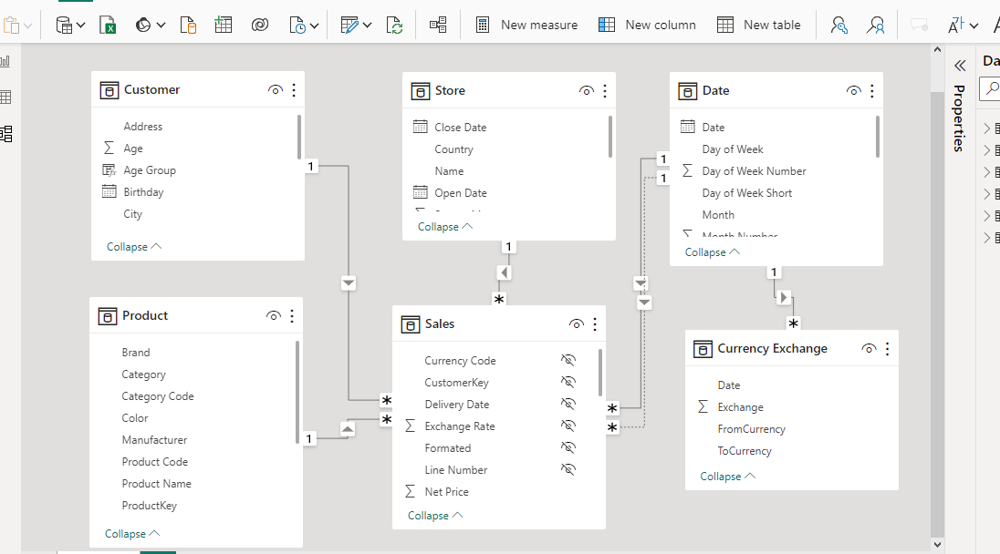
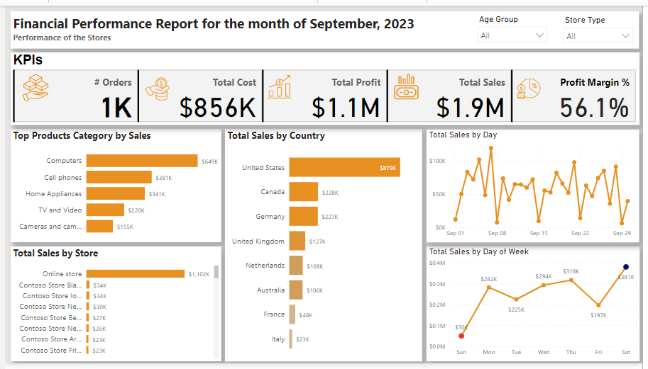

# Contoso Sales Analysis
This project shows the state of the Sales Financial Performance of business during the month, identify growth opportunities and pain points which will help the business plan for the next period.

## Introduction
This is a Power Bi Masterclass project that was organised in the month of August 2023.The project is on sales analysis of a store called **Contoso Stores**. This project shows the state of the Sales Financial Performance of business during the month, identify growth opportunities and pain points which will help the business plan for the next period. 

**_Disclaimer_**: _All datasets and reports do not represent any company, institution or country, but just a dummy dataset to demonstrate capabilities of Power Bi._

## Problem Statement
1.	What is the best and least selling product category?
2.	What is the highest selling store?
3.	Daily and weekly sales.
4.	Which country has the highest sales?
5.	The business KPIs

## Skills/Concept demonstrated:

The following Power BI features were incorporated.
- DAX,
- Modelling
- Filters
- Drill Through

## Data Gathering and Transformation
The data came in a zip folder as a file and to get the data, Here are the steps i took:
- I Download and Install SQL Server Management Studio (SSMS) and Developer Edition
- Restore the .
  
Once i got this done successfully, i was able to get the data to Power BI from the SQL Database, i connected to the database that i setup and extracted the table into the Power BI. The data needed to be transformed and clean for ease of the analysis and it was done using Power Query. The data transformation was done in the power query editor to meet and improve the qualities of the data. 

## Data Modelling
The model is a star schema. There are 5 dimension tables and 1 fact table. The dimension tables are all joined to the fact table with a one-to-many relationship using a common key such as Customer key, Product key, Store key,Dand on the currency and Date table. 

## Visualization

This is a one page report.

You can interactive with the report [here](https://app.powerbi.com/view?r=eyJrIjoiMWYyZjM0ODYtMjM5Mi00NWUyLThkMTgtMWQzMDEwM2VlYmE0IiwidCI6IjUwODUxMjk2LTliZDEtNGM1Yi05MDllLWY2M2U0OWVmZWEyNSJ9)

## Key Insights
1. At **$380,697.7**, Saturday had the highest Total Sales and was 663.04% higher than Sun, which had the lowest Total Sales at **$49,892.3**
2. Across all 7 Day of Week, Total Sales ranged from **$49,892.3** to **$380,697.7**
3. United State had the highest sales of **$879,106.3** and Italy generated the least sales of **$23,499.2. This can also be drill down to the customer demography of this countries, the 
   Male gender generated more of the sales compare to the Female gender. We can also see the age(group) that brought in more sales to the business.
4. **Computers** accounts for *8648,923.7** of the total sales making it the highest selling product category for the month with a total order of **455**. Cell phones with **380,932.1** of    the total sales, attract customers more as this can be seen in the numbers of customer demands of **479** orders.
5. The online store generated a total sales of **$1,102,921.1** 

## Recommendations
1. Day of the Week Analysis: Consider analyzing why Saturday had significantly higher sales compared to Sunday. What factors contributed to this difference? Are there promotions or events 
   that can be replicated on other days to boost sales? Evaluate if there are opportunities to increase sales on Sundays, such as introducing special Sunday-only promotions or marketing 
   strategies.
2. Sales Range Across Days of the Week: Analyze the reasons behind the wide range of total sales across all 7 days of the week. Are there specific days that consistently underperform? 
   Identify patterns and implement strategies to improve sales on those days.
3. Geographic Analysis: For the United States, where sales are the highest, assess the market further to understand what's driving the success. It may be worthwhile to expand marketing 
   efforts in this region. For Italy, where sales are the lowest, consider conducting market research to identify the challenges and opportunities. Are there cultural or economic factors  
   impacting sales in this region?
4. Product Category Analysis: Since "Computers" is the highest selling product category, consider expanding the product range within this category or offering complementary products or 
   services to boost sales further. For "Cell phones," which attract more customers but have lower sales per order, analyze if there are pricing or marketing strategies that can increase 
   the average order value.
5. Sales Channels: Given that the online store generated the most sales, consider investing more in online marketing and improving the online shopping experience. Evaluate the performance 
   of other sales channels (e.g., physical stores or third-party retailers) and consider optimizing their operations if they are not performing as well.
6. Demographic Analysis: Further investigate the demographic data, particularly the gender and age groups that are driving sales. Tailor marketing efforts and product offerings to better 
   target these customer segments.
   
## Others
Customer Feedback: Collect and analyze customer feedback to understand their preferences, needs, and pain points. Use this information to make improvements in products, services, and the overall shopping experience.
Seasonal Trends: Analyze if there are any seasonal trends affecting sales. Adjust marketing strategies and inventory management accordingly to capitalize on peak seasons.
Competitor Analysis: Keep an eye on competitors in the industry. What are they doing differently? Are there strategies or innovations that can be adopted to gain a competitive edge?

You can reach me on [Instagram](https://www.linkedin.com/in/victoriaogwuche/) and [Twitter](https://twitter.com/vicky_star0)
Thank you

   

